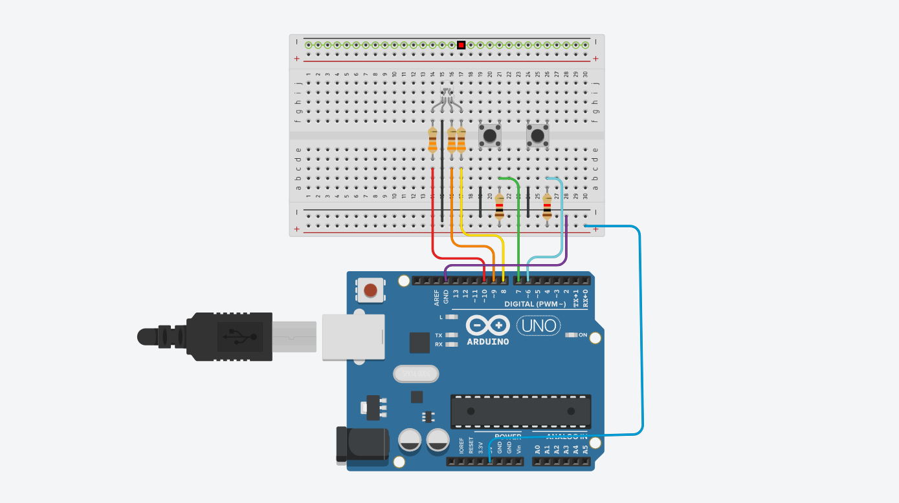
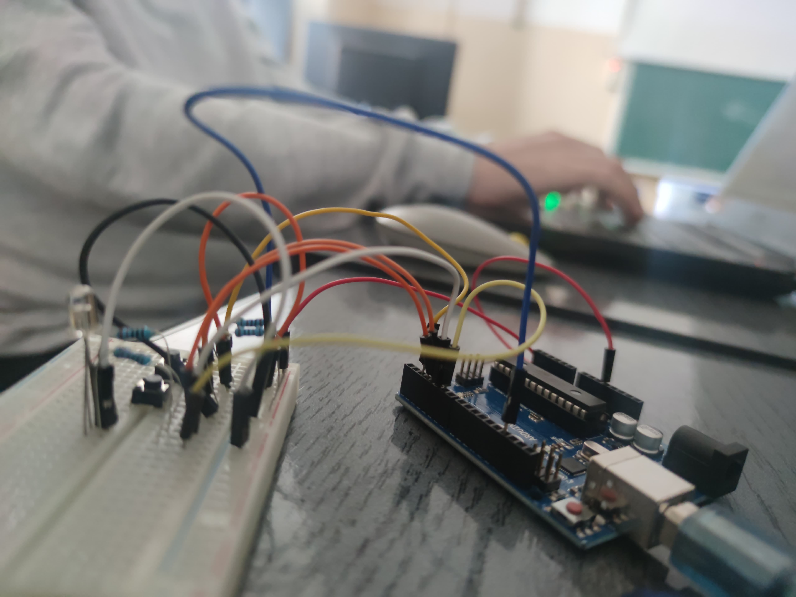
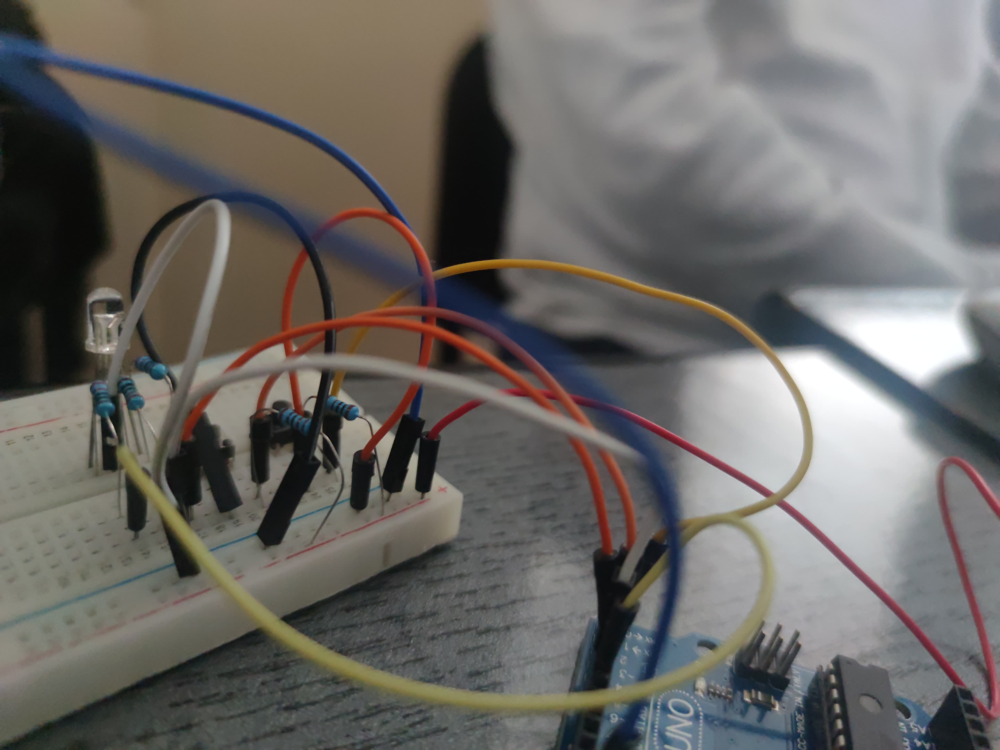
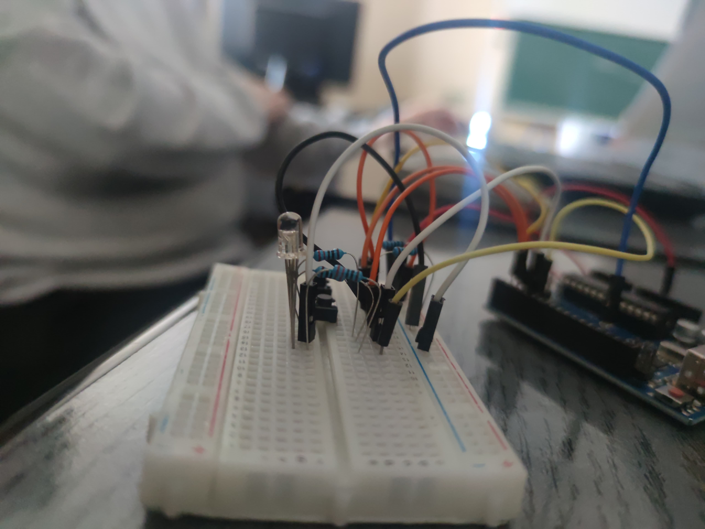
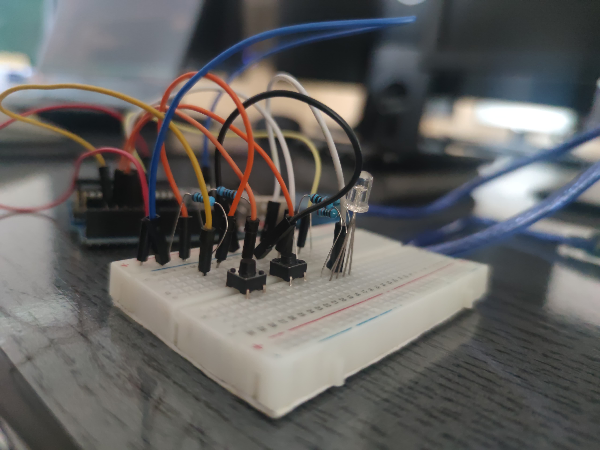
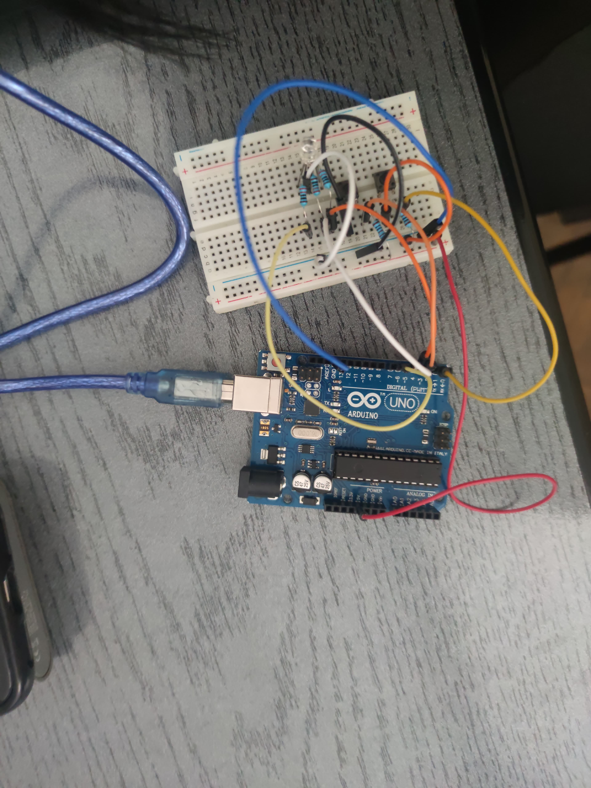

# IntroRobotica---TypeRacer-Game
# TypeRacer Game

## Task Description
In this project, I created a game similar to TypeRacer, where users can test their typing speed. The project utilizes an Arduino UNO to control an RGB LED that indicates the game state and buttons to manage the game round and difficulty.

## Requirements
- The game will start with a 3-second countdown.
- The RGB LED will change color based on the accuracy of the entered text.
- The game difficulty can be set using a button, which will alter the speed at which words appear.
- At the end of each round, the score will be displayed in the terminal.

## Components Used
- **Arduino UNO** (ATmega328P microcontroller)
- **1x RGB LED** (to indicate text accuracy)
- **2x Buttons** (for start/stop round and for selecting difficulty)
- **5x Resistors** (3x 220/330 ohm, 2x 1000 ohm)
- **Breadboard**
- **Jumper wires**

## Wiring Diagram

## Physical Setup

## Video Demonstration of the Physical Setup
[Video Demonstration](https://youtube.com/shorts/4CTRUkjRXb0?feature=share)

## Code Functions Overview

### `startGame()`
- Initiates a new game round.
- Handles the countdown display via the RGB LED, flashing it for 3 seconds.
- Starts the word generation process based on the selected difficulty.

### `generateWord()`
- Randomly selects a word from a predefined dictionary.
- Displays the chosen word in the terminal for the player to type.
- Tracks the time remaining for the round.

### `checkInput()`
- Compares the player's input with the displayed word.
- If the input matches, it changes the RGB LED to green and immediately generates a new word.
- If the input does not match, it changes the LED to red and allows the player to correct their input.

### `setDifficulty()`
- Cycles through the difficulty levels (Easy, Medium, Hard).
- Adjusts the speed at which words appear based on the selected difficulty.
- Sends a message to the serial monitor to inform the user of the current difficulty.

### `endGame()`
- Concludes the game round after 30 seconds.
- Displays the total number of correctly typed words in the terminal.
- Resets the game state to allow for a new round.

## How to Play
1. **Setup**: Assemble the circuit according to the wiring diagram and upload the provided Arduino code to your Arduino UNO.

2. **Starting the Game**:
   - Press the difficulty button to select your preferred difficulty level (Easy, Medium, Hard). Each time you press it, a message will be displayed in the terminal indicating the current difficulty.
   - Press the start/stop button to begin the game. A countdown will be displayed, and the RGB LED will blink for 3 seconds.

3. **Typing the Words**:
   - After the countdown, the RGB LED will turn green, and a word will be displayed in the terminal.
   - You have a limited time to type the displayed word based on the selected difficulty:
     - **Easy**: 5 seconds
     - **Medium**: 3 seconds
     - **Hard**: 2 seconds
   - If you type the word correctly, the LED will stay green, and a new word will appear immediately.
   - If you type the word incorrectly, the LED will turn red. You can correct your input by using the Backspace key to delete characters and retype the word.

4. **Ending the Game**:
   - The game will continue for a total of 30 seconds, with new words appearing at intervals determined by the difficulty level.
   - At the end of the round, your score (the number of correctly typed words) will be displayed in the terminal.
   - You can stop the game at any time by pressing the start/stop button.

5. **Enjoy the Challenge**: Test your typing speed and accuracy against the clock and see how many words you can type correctly!
